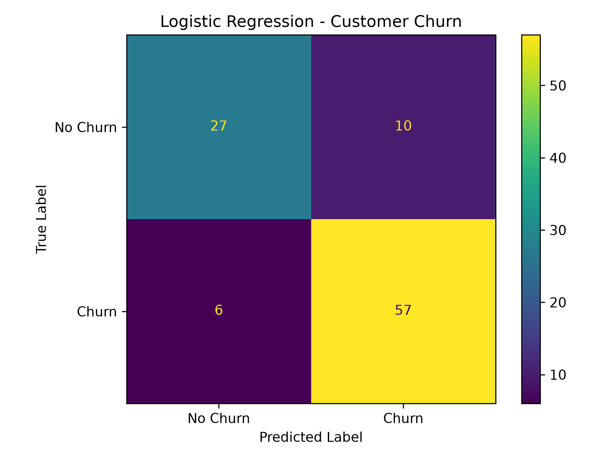
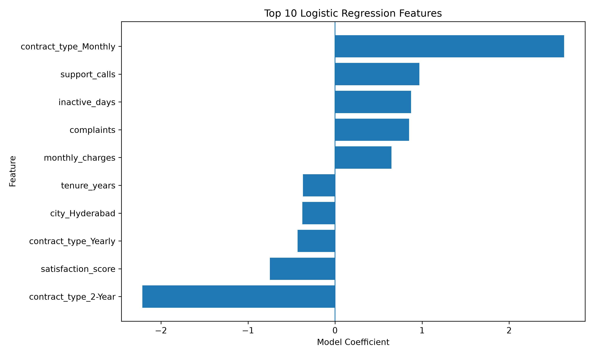

# Customer Churn Prediction

A machine learning project that predicts whether a customer is likely to churn based on customer behavior, subscription details, service usage, and satisfaction-related features.

## Project Overview

Customer churn occurs when a customer stops using a company's products or services.

The goal of this project is to analyze customer data, identify important churn patterns, build machine learning models, compare their performance, and create a prediction system for new customers.

## Objectives

- Inspect and clean customer data
- Perform exploratory data analysis
- Identify customer churn patterns
- Create useful features
- Prepare data for machine learning
- Train classification models
- Evaluate model performance
- Save the best-performing model
- Predict churn for new customers

## Dataset

The dataset contains 500 customer records and 17 original columns.

Important features include:

- Age
- Gender
- City
- Tenure
- Monthly charges
- Total charges
- Contract type
- Payment method
- Internet service
- Support calls
- Complaints
- Login frequency
- Subscription type
- Satisfaction score
- Inactive days
- Churn

## Project Workflow

```text
Raw Customer Data
        ↓
Data Inspection
        ↓
Data Cleaning
        ↓
Exploratory Data Analysis
        ↓
Feature Engineering
        ↓
Data Preparation
        ↓
Model Training
        ↓
Model Evaluation
        ↓
Best Model Selection
        ↓
Model Saving
        ↓
Customer Churn Prediction
```

## Model Results

Two classification models were developed and evaluated.

| Model | Accuracy | Precision | Recall | F1-score |
|---|---:|---:|---:|---:|
| Logistic Regression | 84.00% | 85.07% | 90.48% | 87.69% |
| Random Forest | 79.00% | 79.17% | 90.48% | 84.44% |

Logistic Regression achieved the best overall performance and was selected as the final model for customer churn prediction.

### Confusion Matrix



### Feature Importance



## Technologies Used

- Python
- Pandas
- NumPy
- Matplotlib
- Seaborn
- Scikit-learn
- Joblib
- Git & GitHub

## Installation

### 1. Clone the repository

```bash
git clone https://github.com/Sriram-051015/customer-churn-prediction.git
```

### 2. Open the project folder

```bash
cd customer-churn-prediction
```

### 3. Create a virtual environment

```bash
python -m venv .venv
```

### 4. Activate the virtual environment

For Windows PowerShell:

```powershell
.\.venv\Scripts\Activate.ps1
```

### 5. Install the required libraries

```bash
pip install -r requirements.txt
```

## How to Run the Project

Run the Python files in the following order:

```text
1. inspect_data.py
2. clean_data.py
3. eda.py
4. churn_analysis.py
5. visualize_churn.py
6. feature_engineering.py
7. prepare_data.py
8. baseline_model.py
9. random_forest_model.py
10. evaluate_models.py
11. improved_logistic_model.py
12. predict_churn.py
13. interactive_prediction.py
14. confusion_matrix_plot.py
15. feature_importance.py
```

All Python scripts are located inside the `src` folder.

Example:

```bash
python src/inspect_data.py
```

## Example Prediction

The trained Logistic Regression model can predict whether a new customer is likely to churn and provide an estimated churn probability.

Example:

```text
Will the customer churn? Yes
Churn Probability: 99.85%
```

## Key Churn Insights

The exploratory analysis identified several important patterns:

- Monthly contract customers showed a higher churn rate.
- Customers with higher support calls showed stronger churn tendency.
- Customers with more complaints showed stronger churn tendency.
- Longer-term contracts generally showed lower churn.
- Customer satisfaction and inactivity were important predictive factors.

## Future Improvements

- Try additional machine learning algorithms
- Perform hyperparameter tuning
- Use a larger real-world dataset
- Build a web-based prediction interface
- Create an interactive Power BI dashboard
- Deploy the model as an API

## Project Structure

```text
customer_churn_prediction/
│
├── data/
│   ├── customer_churn_sample_500.csv
│   ├── customer_churn_cleaned.csv
│   └── customer_churn_features.csv
│
├── src/
│   ├── inspect_data.py
│   ├── clean_data.py
│   ├── eda.py
│   ├── churn_analysis.py
│   ├── visualize_churn.py
│   ├── feature_engineering.py
│   ├── prepare_data.py
│   ├── baseline_model.py
│   ├── random_forest_model.py
│   ├── evaluate_models.py
│   ├── improved_logistic_model.py
│   ├── predict_churn.py
│   ├── interactive_prediction.py
│   ├── confusion_matrix_plot.py
│   └── feature_importance.py
│
├── models/
│   └── logistic_regression_model.pkl
│
├── results/
│   ├── eda_summary.txt
│   ├── model_results.txt
│   ├── logistic_confusion_matrix.png
│   └── logistic_feature_importance.png
│
├── dashboard/
├── notebooks/
├── requirements.txt
├── README.md
└── .gitignore
```

## Author

Sriram

## Disclaimer

This project is created for educational and portfolio purposes. The dataset is a sample dataset and the predictions should not be treated as real-world business decisions.